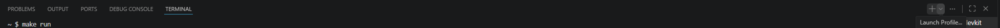
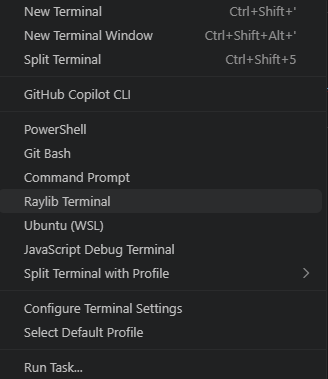

# arkanoid.projeto

Olá! Este é um pequeno tutorial de como rodar o nosso jogo: Arkanoid - Beat this up!

Primeiramente, tenha certeza de que possui a raylib instalada no seu computador. Caso não popssua, pode baixar pelo site oficial da Raylib.

Se já possui, então poderá copiar esse repositório para uma pasta desejada ou baixar e, em seguida, abri-lo no VSCode.
Em seguida, quando abrir, aperte CTRL + J para abrir o terminal, e assim que abri-lo poderá ver que no canto possui um símbolo de +

Clique na seta ao lado do símbolo, e selecione o terminal da Raylib (Raylib Terminal).

Quando abrir, digite o seguiunte comando: cd C:/Users/USER/CaminhoParaOJogo (Pode encontrar isso no proprio terminal do VSCODE ao abrir a pasta no VSCode)
Isso abrirá o diretório da pasta do jogo instalada no seu computador.
Após abrir, apenas digite o comando "make run" (sem as áspas) e aproveite o jogo!
https://github.com/user-attachments/assets/82bf92c3-d059-4b42-a076-3764f9ee4d0a
